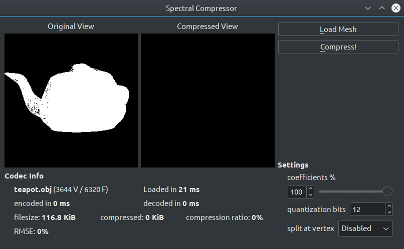

# Ghost3DZip #

This is the spectral compressor for 3d meshes developed for my master thesis in 2010.
Name back then was just *speccomp*.

### Required Libraries ###

* Boost (sigh. required by dependencies)
* Eigen v2
* Qt v4 (optional, for GUI)
* QGLViewer (optional, for GUI)

### External Code ###

Since no one likes to reinvent the wheel, there is some external code used in this project:

* METIS (http://glaros.dtc.umn.edu/gkhome/metis/metis/overview) - customized 4.0.1 version, used to split mesh into partitions
* Huffman Codec by Marcus Geelnard (marcus.geelnard at home.se) - used for compression of results
* libHDS (https://code.launchpad.net/~djgaspa/+junk/libhds) - used to load mesh from OFF or OBJ files
* 3dzip (https://code.launchpad.net/~djgaspa/3dzip/3dzip) - a reference for compression effectiveness / correctness

### GUI ###

A very simple GUI is available

